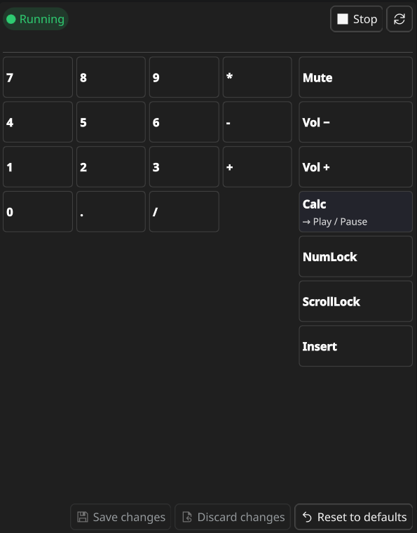

<h1>
  
  Kinesis FN Mapper
</h1>

<p align="center">
  <a href="https://store.kde.org/p/2364571">
    
  </a>
</p>

Kinesis FN Mapper puts the FN-layer keys of a Kinesis Freestyle2 (KB800) keyboard to work
on KDE Plasma 6. Those are the numpad overlay and the media/lock keys that FN normally locks
you into. Pick any FN key in the widget and choose what it does: pass it through so it behaves
normally, block it so it sends nothing, remap it to another key or shortcut, or run a command
each time you press it. Everything is set up from a Plasma widget, no config files required.

<p align="center">
  
  <br><em>The widget: numpad grid on the left, media/lock FN column on the right.</em>
</p>

<p align="center">
  See <a href="docs/screenshots.md">Screenshots</a> for each action shown in the editor.
</p>

## Requirements

- **KDE Plasma 6** (the applet requires Plasma API ≥ 6.0)
- **Python 3** with **[python-evdev](https://python-evdev.readthedocs.io/)**
- **polkit** (`pkexec`) — the plasmoid uses it to start/stop the daemon as root
- A **Kinesis Freestyle2 / KB800** keyboard
- The daemon needs root: it reads `/dev/input/*` and writes `/dev/uinput`

## Install

```bash
git clone https://github.com/mnoomnoo/kinesis-FN-mapper.git
cd kinesis-FN-mapper
```

**1. Install the daemon dependency** (`python-evdev`) — use your distro package if
you have one, otherwise pip:

```bash
sudo dnf install python3-evdev      # Fedora
# sudo apt install python3-evdev    # Debian/Ubuntu
# pip install --user evdev          # any distro
```

**2. Install the plasmoid.** The recommended way for this repo is a **symlink**, so
your edits to the source are live with no reinstall step. Just run the bundled
script:

```bash
./install.sh
```

It symlinks both the applet package **and** its icon back to the repo, refreshes the
caches, and reloads the shell. Doing it by hand is equivalent to:

```bash
# applet package
ln -s "$PWD/plasmoid" ~/.local/share/plasma/plasmoids/com.desky.kinesisfn
# icon into the user icon theme (see note below)
ln -s "$PWD/plasmoid/contents/icons/kinesisfn.svg" \
      ~/.local/share/icons/hicolor/scalable/apps/kinesisfn.svg
kquitapp6 plasmashell && kstart plasmashell   # reload the shell
```

> ℹ️ **Why the icon symlink?** The system-tray icon is loaded from the package by
> path, but the **"Add Widgets" explorer** resolves `metadata.json`'s
> `"Icon": "kinesisfn"` through the **freedesktop icon theme** — not the package. So
> the SVG must be installed into an icon theme (`hicolor/scalable/apps`), or the
> widget-listing entry shows a blank icon.

> ⚠️ **Never run `kpackagetool6 --type Plasma/Applet -u plasmoid` against the
> symlinked install.** The upgrade removes the existing package first, and with a
> symlinked dev install that follows the link and **deletes your source tree**. To
> apply changes just restart plasmashell (above) or re-add the widget.

If you'd rather install a plain **copy** (not a dev symlink), use:

```bash
kpackagetool6 --type Plasma/Applet -i plasmoid
```

**3. Add the widget.** Right-click a panel or the desktop → *Add Widgets…* → search
for **"Kinesis FN Mapper"**.

## Usage

1. Open the widget (click its icon in the panel).
2. Click a key tile. The tiles are arranged like the physical keyboard: the numpad
   overlay grid on the left, the media/lock FN column on the right.
3. Pick an action in the editor:
   - **Pass through** — key behaves normally.
   - **Block** — key sends nothing.
   - **Remap** — send another key, optionally with Ctrl/Alt/Shift/Super held.
   - **Run command** — run a shell command once per press (e.g. `kcalc`).
4. Click **Save**.
5. Click **Start** (or **Restart** if it's already running) and authorise the
   `pkexec` prompt.

The status pill shows **Running** / **Stopped** (polled every 2 s). The daemon reads
the config **once at startup**, so after saving changes you must **Restart** it to
apply them.

### Config file

Both halves share:

```
~/.config/kinesis-fn/fn_map.json
```

It's seeded from the built-in defaults the first time the daemon runs. It's a JSON
object keyed by evdev `KEY_*` name, one entry per FN key:

```jsonc
{
  "KEY_CALC": { "type": "remap", "keys": ["KEY_PLAYPAUSE"] },
  "KEY_KP7":  { "type": "remap", "keys": ["KEY_LEFTCTRL", "KEY_C"] },
  "KEY_KP1":  { "type": "run",   "cmd": "gnome-terminal" },
  "KEY_MUTE": { "type": "block" },
  "KEY_KP5":  { "type": "pass" }
}
```

- `pass` — re-emit the key unchanged.
- `block` — swallow it.
- `remap` — emit `keys` instead; **list modifiers first** (they're pressed in order
  on key-down, released in reverse on key-up).
- `run` — run `cmd` in a shell, once per physical press. Although the daemon runs as
  root, the command is launched **as your desktop user in your current session**, so GUI
  apps (e.g. `code`, `kcalc`) open normally.

You can edit this file by hand instead of using the widget; restart the daemon either
way.

### Running the daemon standalone

```bash
sudo python3 fn_remap.py [/dev/input/eventN] [--config PATH]
```

- The device defaults to auto-detecting the Kinesis node via
  `/dev/input/by-id/*Kinesis*-event-kbd`.
- `--config` defaults to the invoking user's `~/.config/kinesis-fn/fn_map.json`
  (resolved correctly even under `sudo`/`pkexec`).
- Stop with **Ctrl-C** — the grab is always released on exit, so the keyboard
  recovers.

> **Recovery:** while the daemon holds the grab, if it ever wedges the keyboard
> appears dead. Kill it from another terminal (`pkill -f fn_remap`) or unplug/replug
> the keyboard.

## Development

Because the plasmoid is symlinked, **edits to the repo are live immediately** — no
install step. To see QML/JS changes, reload the shell:

```bash
kquitapp6 plasmashell && kstart plasmashell
```

(or just remove and re-add the widget).

### Previewing with plasmoidviewer

To run the widget in its own window without touching the panel — and without even
installing it — point `plasmoidviewer` (from `plasma-sdk`) at the package dir:

```bash
plasmoidviewer -a ~/pprojects/kinesis-FN-mapper/plasmoid
```

It still locates `fn_remap.py` (resolved relative to the package), so `Start`/
`Restart` work as usual.

### Packaging a release

To build the distributable `.plasmoid` archive (the file you upload to the KDE
Store):

```bash
./package.sh
```

It reads the version from `plasmoid/metadata.json` and writes
`dist/kinesis-fn-mapper-<version>.plasmoid`. The archive is a ZIP with
`metadata.json` at its **root** — the script guarantees this by zipping from inside
`plasmoid/`. **Bump `KPlugin.Version` in `plasmoid/metadata.json` before packaging**,
or the store will reject the re-upload as unchanged.

### Adding or changing an FN key

The FN key set is defined in **two** places that must stay in sync:

- `DEFAULT_FN_ACTIONS` in `fn_remap.py` — the daemon's defaults and the authoritative
  key set.
- `FN_KEYS` in `keydata.js` — what the editor exposes; also add the code to
  `NUMPAD_GRID` or `FN_COLUMN` so it appears as a tile.

### Debugging the daemon

Run it in a terminal (`sudo python3 fn_remap.py`) to watch its startup line (which
device/config it grabbed and how many keys) and `run`-action logs.

## How it works

On the KB800 the **FN** key is handled in firmware and is invisible to software; all
it does is make the affected keys emit *different* keycodes (numpad codes, media
codes). `fn_remap.py` takes exclusive control of the keyboard's evdev node with
`EVIOCGRAB`, re-emits every ordinary key untouched through a `uinput` virtual
keyboard, and for the FN-layer keycodes applies the action from the config. Keying
off those codes is effectively "FN + key".

The plasmoid never touches the keyboard directly — it just edits the shared JSON and
runs the daemon via `pkexec`. The config is the contract between the two.

## License & Trademarks

MIT — see the source headers/`metadata.json`.

This is an independent, unofficial project and is not affiliated with, endorsed by, or
sponsored by Kinesis Corporation. "Kinesis", "Freestyle2", and "KB800" are trademarks of
Kinesis Corporation, used here solely for nominative/descriptive purposes to indicate the
hardware this tool works with.
