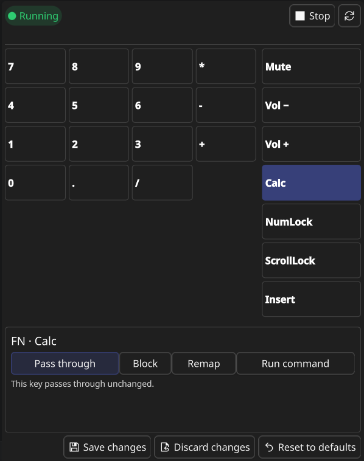
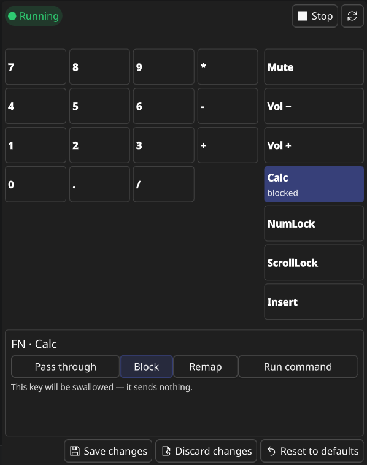
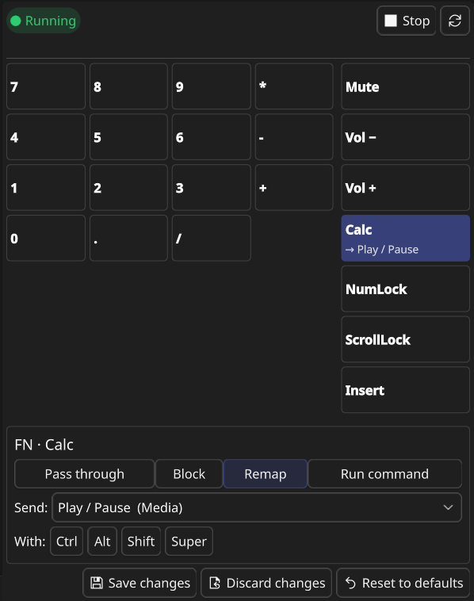
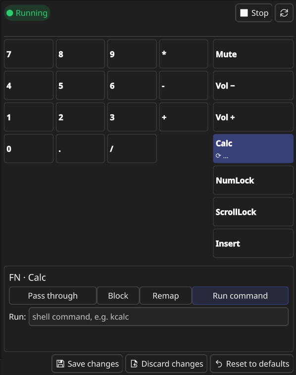

# Screenshots

The four things you can do with an FN key, shown in the widget's editor.

  
   <em>The widget: numpad grid on the left, media/lock FN column on the right.</em>

<table align="center">
  <tr>
    <td align="center" width="50%"> <b>Pass through</b> — key behaves normally</td>
    <td align="center" width="50%"> <b>Block</b> — key sends nothing</td>
  </tr>
  <tr>
    <td align="center" width="50%"> <b>Remap</b> — send another key (+ modifiers)</td>
    <td align="center" width="50%"> <b>Run command</b> — run a shell command per press</td>
  </tr>
</table>
